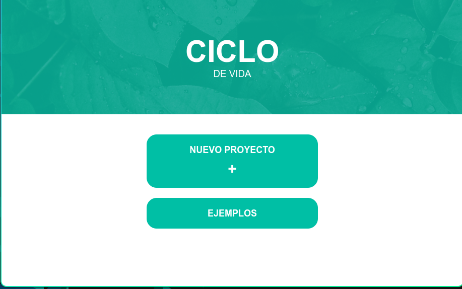
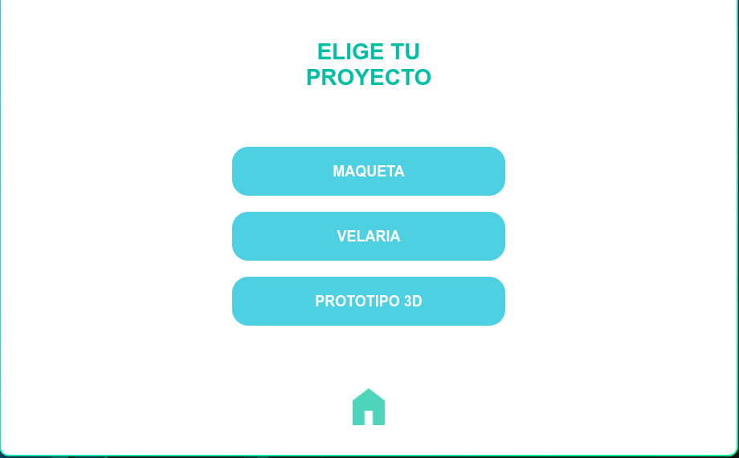
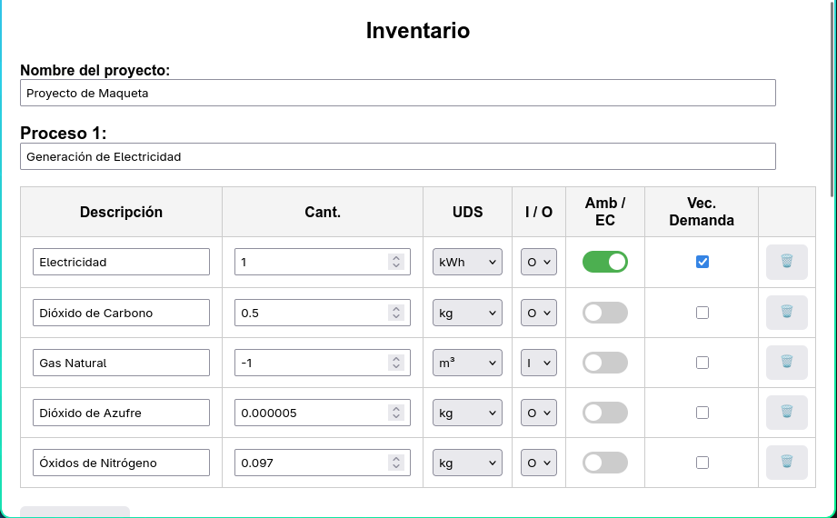
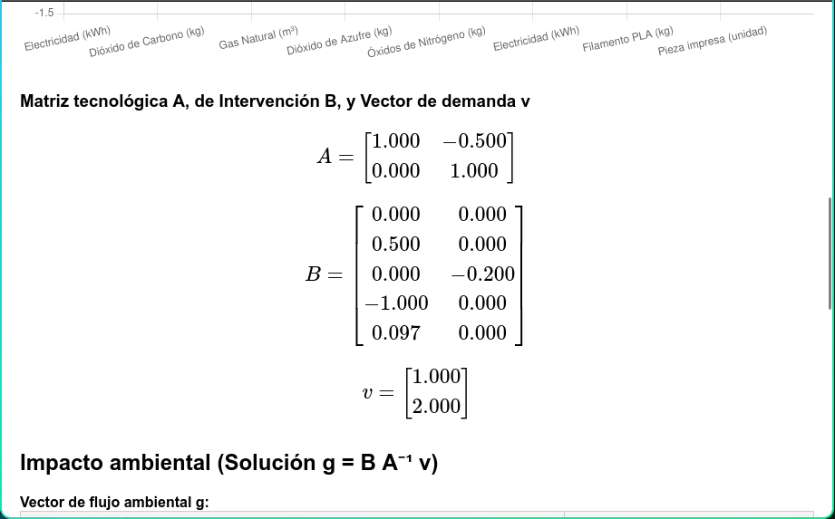

# Ciclo de Vida
## WebApp

[ENG](readme_ENG.md)

Esta App está diseñada para la enseñanza y exploración de análisis cualitativos de ciclos de vida en áreas de Diseño. Su uso incluye tres funciones operacionales: describir procesos de manufactura en términos de *Inputs* y *Outputs* , calcular el vector de flujo ambiental, y hacer consultas a una base de datos.

A diferencia de otros software Análisis de Ciclo de Vida, esta aplicación cuenta con una interfaz intuitiva. Sin embargo, en su versión actual sólo tiene las tres funciones arriba mencionadas. A través de un menú se accede a sus dos modos de uso: Describir un conjunto de procesos de manufactura desde cero (a través del botón **Nuevo Proyecto**), o realizar el análisis con alguno de los tres ejemplos propuestos los cuales también son editables.

Las bases teóricas que sustentan los cálculos en esta App dependen del planteamiento de un sistema de ecuaciones definido a partir de tres arreglos: matriz tecnológica, matriz de intervención, y vector de demanda. Para ello hemos utilizado la siguiente referencia:

Heijungs, R., & Suh, S. (2002). _The Computational Structure of Life Cycle Assessment_ (S. Suh, Ed.). Springer Netherlands.


### Requisitos

Esta webApp requiere de:

* Navegador web.
* Python 3.
* Conexión a Internet.

Adicionalmente a la distribución de Python, se necesitan instalar los módulos que listados en el archivo `requirements.txt`. Estas dependencias pueden instalarse al ejecutar el siguiente comando:

```
pip install -r requirements.txt
```

### Descarga de las bases de datos

Esta App necesita dos bases de datos de impacto ambiental: TRACI y CML-IA.

**Opción 1** (Windows y Linux)

Este repositorio incluye dos archivos de descarga de las bases de datos:

* **win_db_downloader.bat**.
* **linux_db_downloader.sh**.

En cada uno, el nombre especifica el sistema operativo en el que debe ejecutarse. Al hacerlo, automáticamente se crea un directorio llamado `databases` dentro del cual se descargan las bases de datos. 

**Opción 2** (Descarga manual)

1) Copiar y pegar las siguientes URLs en la barra de direcciones de un navegador web:

```
http://www.leidenuniv.nl/cml/ssp/databases/cmlia/cmlia.zip

https://www.epa.gov/system/files/documents/2024-01/traci_2_2.xlsx
```

2) Crear dentro de este directorio una carpeta llamada **databases**, dentro de ellas debemos copiar el archivo xlsx y el contenido dentro del archivo zip. Al final, la carpeta databases debe contener los siguientes archivos:

```
├── databases
│		├── CML-IA_aug_2016.xls
│		├── CML-IA_august_2016_update_info.xls
│		└── traci_2_2.xlsx
```

### Uso

1) Una vez instalados los requisitos y descargada la base de datos, necesitamos iniciar el servidor flask con el que opera esta webApp. La forma más fácil es abrir una terminal (o Powershell, en Windows) en la ruta donde se encuentren los archivos de este directorio y ejecutar el siguiente comando:

```
flask run --host=0.0.0.0 --port=5000
```

2) Abrir el archivo `index.html` con cualquier navegador web. 

3) La App cuenta con tres ejemplos que muestran su funcionamiento.

### Galería

<table>
  <tr>
    <td>
      <!-- Im 1 -->
      
    </td>
    <td>
      <!-- Im 2 -->
      
    </td>
    <td>
      <!-- Im 3 -->
      
    </td>
    <td>
      <!-- Im 4 -->
      
    </td>
  </tr>
</table>

### Licencia

Distribución de la WebApp bajo licencia GNU2.

Este proyecto depende de las siguientes librerías de terceros (_third-party libraries_):

* Chart.js (static/js/char.min.js)
* MathJax (static/js/mathjax)
* Numeric.js (static/js/numeric.min.js)

Cuyas respectivas licencias incluimos en el directorio LICENSES.

### Agradecimientos

Proyecto apoyado por PAPIME PE103824.
